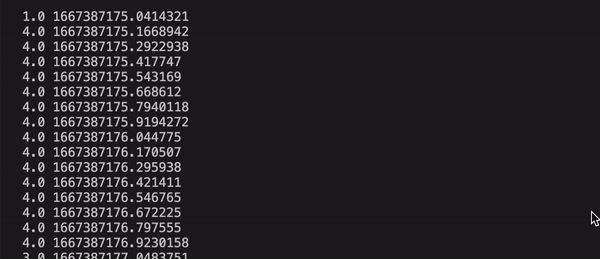

In this example, we show how to simulate an online classifier using a pre-recorded file of EMG. This could be useful for mocking a simulation after completion. For example, you could re-run a previously Fitts law test or gameplay session. Additionally, this enables the exploration of online classification without needing a device.

# Code
```Python
from libemg.datasets import OneSubjectMyoDataset
from libemg.data_handler import OfflineDataHandler, OnlineDataHandler
from libemg.offline_metrics import OfflineMetrics
from libemg.feature_extractor import FeatureExtractor
from libemg.emg_classifier import EMGClassifier, OnlineEMGClassifier
from libemg.utils import mock_emg_stream

if __name__ == "__main__":
    # setup variables
    window_size = 50
    increment_size = 25
    num_channels = 8

    # get the predefined one subject myo dataset
    dataset = OneSubjectMyoDataset(save_dir='example_data', redownload=False)
    # take the downloaded dataset and load it as an offlinedatahandler
    odh = dataset.prepare_data(format=OfflineDataHandler)

    # split the data into training and testing
    train_data = odh.isolate_data("sets",[0])
    test_data  = odh.isolate_data("sets",[1])

    # from the standardized data, perform windowing
    train_windows, train_metadata = train_data.parse_windows(window_size,increment_size)
    test_windows, test_metadata = test_data.parse_windows(window_size,increment_size)

    # extract hudgin's time domain features 
    fe = FeatureExtractor(num_channels=8)
    train_features = fe.extract_feature_group('HTD', train_windows)
    test_features = fe.extract_feature_group('HTD', test_windows)

    # get the dataset ready for the classifier
    data_set = {}
    data_set['testing_features'] = test_features
    data_set['training_features'] = train_features
    data_set['testing_labels'] = test_metadata["classes"]
    data_set['training_labels'] = train_metadata["classes"]
    
    # offline metrics 
    om = OfflineMetrics()

    # iterate through four classifiers and determine the most performant
    models = ['LDA', 'SVM', 'NB', 'RF']
    metrics = ['CA']
    accuracies = []
    for model in models:
        classifier = EMGClassifier(model, data_set.copy())
        preds = classifier.run()
        metrics = om.extract_offline_metrics(metrics, data_set['testing_labels'], preds, 2)
        accuracies.append(metrics['CA'])

    # choose model with the best offline accuracy on the testing data
    model = models[accuracies.index(max(accuracies))]

    # run mock online classifier 
    mock_emg_stream("example_data/OneSubjectMyoDataset/stream/raw_emg.csv", num_channels=num_channels, sampling_rate=200)
    online_dh = OnlineDataHandler(emg_arr=True)
    online_dh.start_listening()
    online_classifier = OnlineEMGClassifier(model=model, data_set=data_set.copy(), num_channels=num_channels, window_size=window_size, window_increment=25, online_data_handler=online_dh, features=fe.get_feature_groups()['HTD'], std_out=True)
    online_classifier.run(block=True)
```

# Output
Since the std-out flag is true, the classifier will print to the command line. The number on the left is the predicted class label with its associated timestamp in milliseconds. Note that this same data will be streaming to the specified UDP socket.


