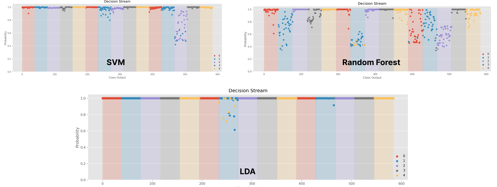
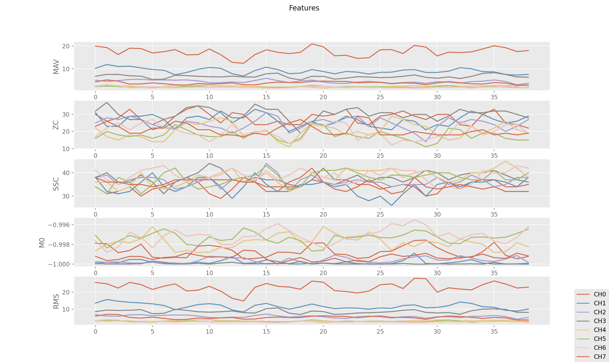

As part of the toolbox, we believe visualizations are crucial to help understand each module and the EMG pipeline. Therefore, most modules have a built-in `visualize()` function (check the API for the exact details). In this example, we exemplify several ways to visualize the pipeline associated with their visual elements. 

# Decision Stream Visualization
The decision stream visualization shows the class of each prediction (colour) and the predicted probability associated with it. 

## Code
```Python
import numpy as np
from libemg.datasets import OneSubjectMyoDataset
from libemg.emg_classifier import EMGClassifier
from libemg.feature_extractor import FeatureExtractor
from libemg.data_handler import OfflineDataHandler
        
def visualize_offline_decision_stream():
    # get the predefined one subject myo dataset
    dataset = OneSubjectMyoDataset(save_dir='example_data', redownload=False)
    # take the downloaded dataset and load it as an offlinedatahandler
    odh = dataset.prepare_data(format=OfflineDataHandler)

    # split the data into training and testing
    train_data = odh.isolate_data("sets",[0])
    test_data  = odh.isolate_data("sets",[1])
    
    # values=[0] corresponds to training since the 0th element of sets_values is training
    train_windows, train_metadata = train_data.parse_windows(50,25)
    test_windows, test_metadata = test_data.parse_windows(50,25)

    fe = FeatureExtractor()

    data_set = {}
    data_set['testing_features'] = fe.extract_feature_group('HTD', test_windows)
    data_set['training_features'] = fe.extract_feature_group('HTD', train_windows)
    data_set['testing_labels'] = test_metadata['classes']
    data_set['training_labels'] = train_metadata['classes']

    for m in ['SVM', 'RF', 'LDA']:
        classifier = EMGClassifier(m, data_set.copy())
        classifier.run()
        classifier.visualize()

if __name__ == "__main__" :
    visualize_offline_decision_stream()
```

## Output


# Feature Visualization
Visualize a number of extracted features on a given set of windows.

## Code 
```Python
import numpy as np
from libemg.utils import get_windows
from libemg.feature_extractor import FeatureExtractor

def visualize_features():
    # Load data and split into windows
    data = np.loadtxt("example_data/OneSubjectMyoDataset/training/R_0_C_0.csv", delimiter=",")
    windows = get_windows(data, 50, 25)
    
    # Create feature extractor and extract features
    fe = FeatureExtractor()
    feature_list = ['MAV', 'ZC', 'SSC', 'WFL', 'M0', 'RMS']
    extracted_features = fe.extract_features(feature_list, windows)

    # Visualize features 
    fe.visualize(extracted_features)

if __name__ == "__main__" :
    visualize_features()   
```

## Output


# Raw EMG (Online Data Handler) Visualization
Visualize the raw EMG, useful for sanity checking. 

## Code 
```Python
from libemg.utils import mock_emg_stream
from libemg.data_handler import OnlineDataHandler

def visualize_live_emg():
    mock_emg_stream("example_data/OneSubjectMyoDataset/stream/raw_emg.csv", num_channels=8, sampling_rate=200)
    online_dh = OnlineDataHandler(emg_arr=True)
    online_dh.start_listening()
    online_dh.visualize(y_axes=[-120,120])    

if __name__ == "__main__" :
    visualize_live_emg()
```

## Output
