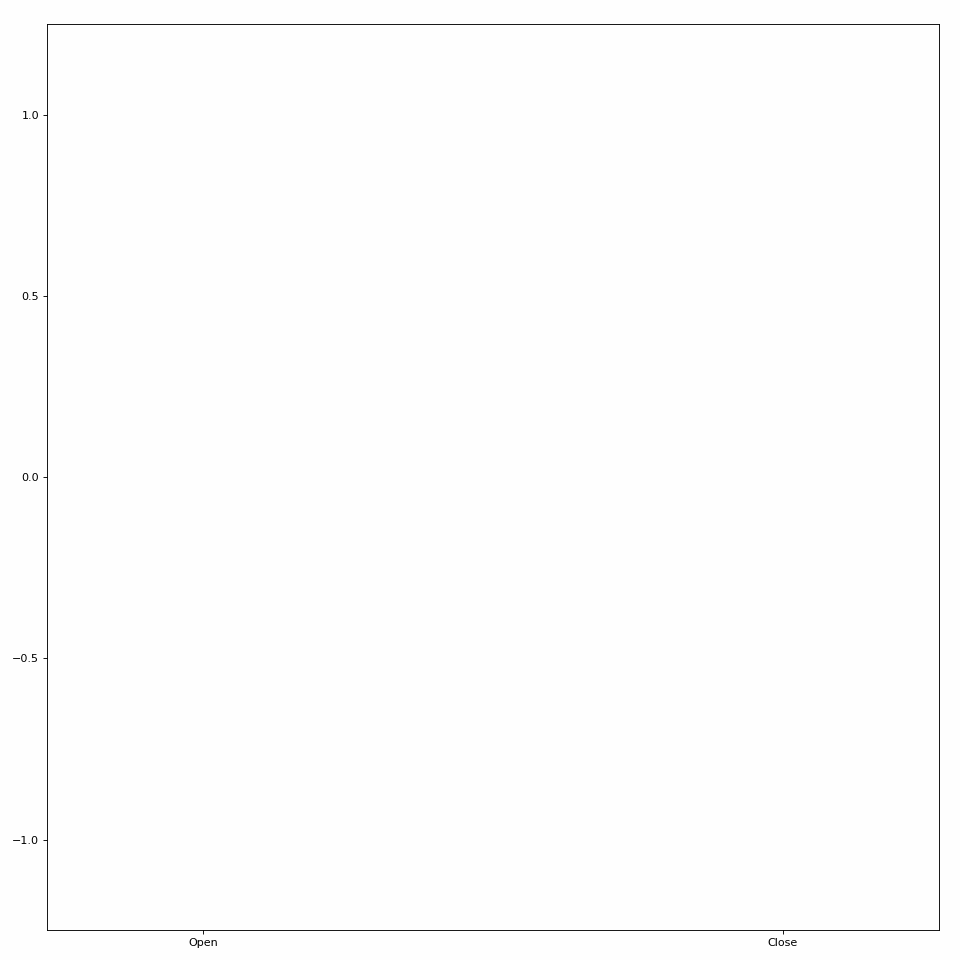
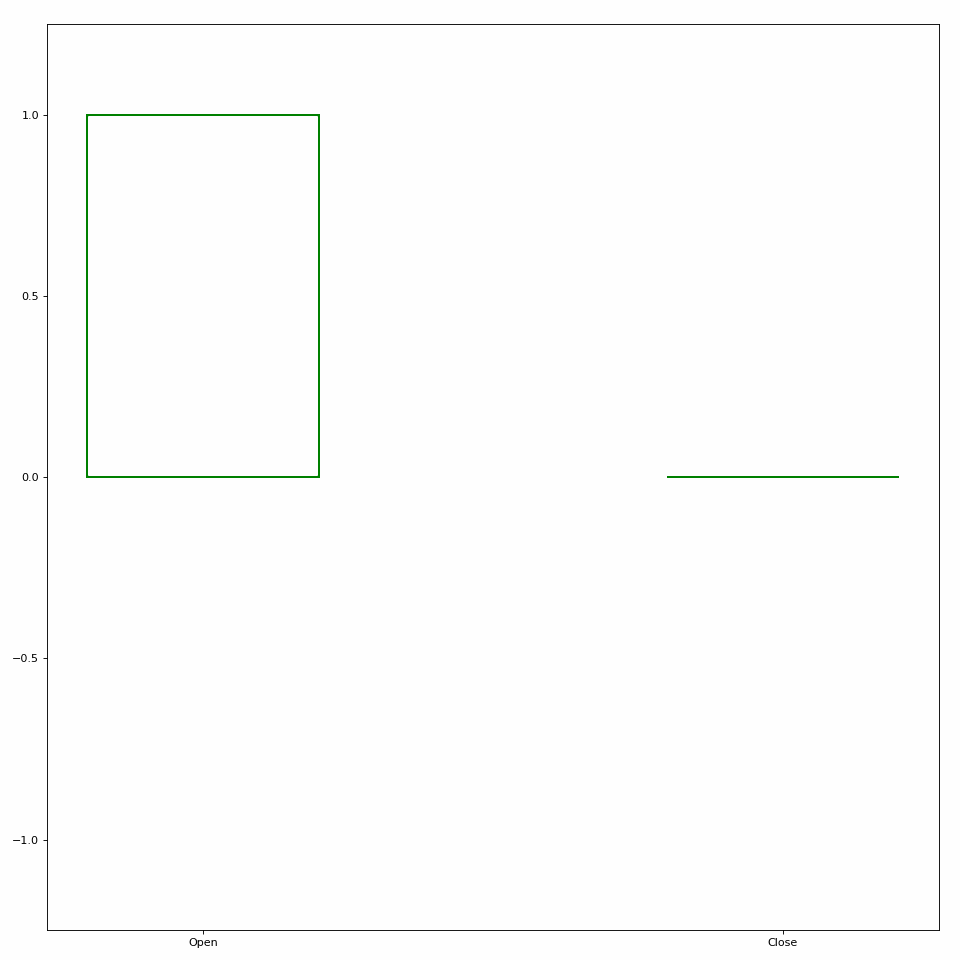
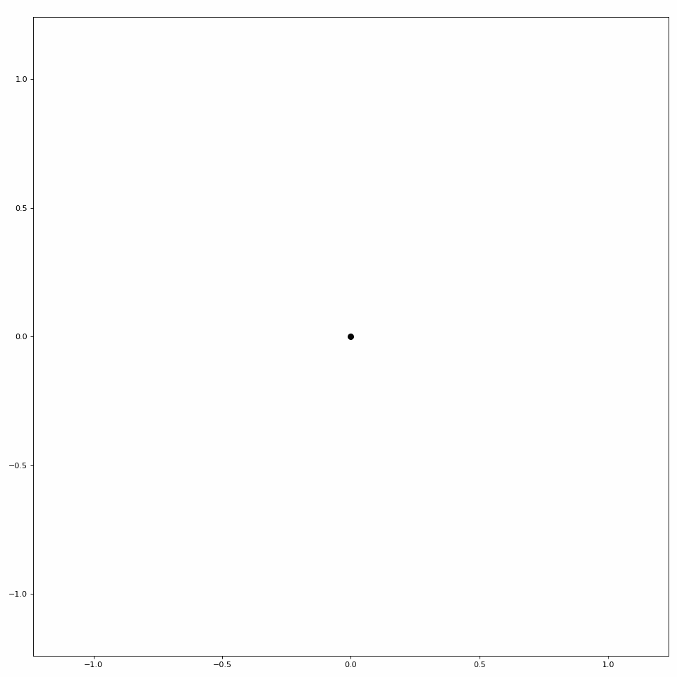
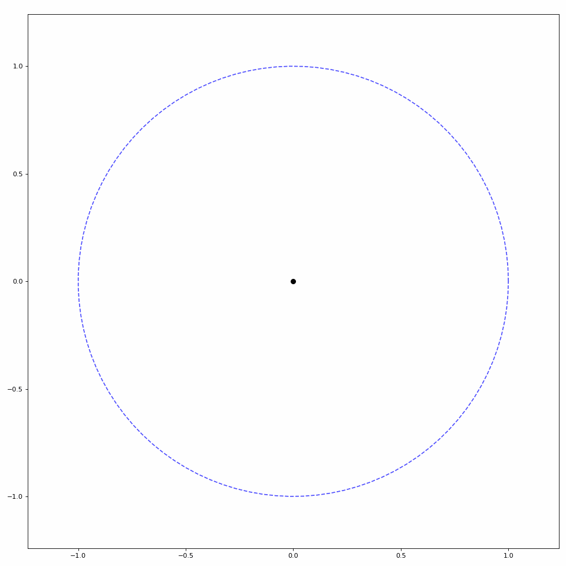

## Use Case

The `Animator` class offers some simple functionality to create animations in multiple video formats (e.g., .gif and .mp4). Specific `Animator` classes have been created to help create specific visual prompts, such as bar plots and cartesian plots. These prompts are primarily used for training of regression-based myoelectric control systems, but the `Animator` class can also be used to generate these prompts for any purpose. For fully custom animations, you can inherit from the `Animator` class and pass a set of frames to `save_video()` (see other `Animators` for examples). If you'd rather implement a custom plotting animation that isn't supported, you can inherit from `PlotAnimator` instead.

For all further examples, we will use a generated set of coordinates to illustrate the difference between plots.

```Python
import numpy as np

fps = 24
coordinates = np.concatenate((
    np.linspace(0, 1, num=fps),  # each movement is 24 frames -> 1 second
    np.ones(2 * fps),   # steady state
    np.linspace(1, -1, num=2 * fps),
    np.ones(2 * fps) * -1,
    np.linspace(-1, 0, num=fps)
))
coordinates = np.hstack((
    np.expand_dims(coordinates, 1),
    np.zeros((coordinates.shape[0], 1))
))
```

## Bar Plots

One type of `Animator` built into `LibEMG` creates bar plot animations. Pass in an array of coordinates to the `plot_icon` method to create a bar plot visualization (see Figure 1).

```Python
from libemg.animator import BarPlotAnimator

animator = BarPlotAnimator(['Open', 'Close'], fps=fps)
animator.save_plot_video(coordinates)
```


<p align="center">Figure 1: Simple bar plot animation.</p>

Additional information can also be shown during these animations, such as the next destination and a countdown for steady states (see Figure 2).

```Python
animator = BarPlotAnimator(['Open', 'Close'], fps=fps, show_countdown=True, show_direction=True)
animator.save_plot_video(coordinates)
```


<p align="center">Figure 2: Bar plot animation with added information.</p>

Parameters such as the time per unit distance, figure size, and more can also be modified. See the `BarPlotAnimator` API for more details.

## Scatter Plots

`LibEMG` also provides a helper class to animate scatter plots (see Figure 3).

```Python
from libemg.animator import ScatterPlotAnimator

animator = ScatterPlotAnimator(['Open', 'Close'], fps=fps)
animator.save_plot_video(coordinates)
```


<p align="center">Figure 3: Simple scatter plot animation.</p>

Similar to the bar plot animation, extra information can be added such as next destination, a countdown, and a unit circle boundary (see Figure 4).

```Python

animator = ScatterPlotAnimator(['Open', 'Close'], fps=fps, show_countdown=True, show_direction=True, show_boundary=True)
animator.save_plot_video(coordinates)
```


<p align="center">Figure 4: Scatter plot animation with added information.</p>

Parameters such as the time per unit distance, figure size, and more can also be modified. See the `ScatterPlotAnimator` API for more details.
