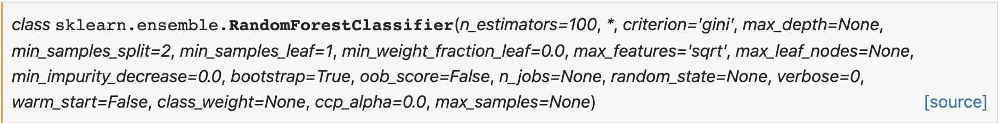

# Classifiers
After recording, processing, and extracting features from a window of EMG data, it is passed to a machine learning algorithm for classification. These control systems have evolved in the prosthetics community for continuously classifying muscular contractions for enabling prosthesis control. Therefore, they are primarily limited to recognizing static contractions (e.g., hand open/close and wrist flexion/extension) as they have no temporal awareness. Currently, this is the form of recognition supported by LibEMG and is an initial step to explore EMG as an interaction opportunity for general-purpose use. This section highlights the machine-learning strategies that are part of LibEMG's pipeline. Additionally, a number of post-processing methods (i.e., techniques to improve performance after classification) are explored.

## Statistical Models

The statistical classifiers (i.e., traditional machine learning methods) implemented leverage the sklearn package. For most cases, the "base" classifiers use the default options, meaning that the pre-defined models are not necessarily optimal. However, the `parameters` attribute can be used when initializing the classifiers to pass in additional sklearn parameters in a dictionary. For example, looking at the `RandomForestClassifier` docs on sklearn:



A classifier with any of those parameters using the `parameters` attribute. For example:
```Python
parameters = {
    'n_estimators': 99,
    'max_depth': 20,
    'random_state': 5,
    'max_leaf_nodes': 10
}
classifier.fit(data_set, parameters=parameters)
```

Please reference the [sklearn docs](https://scikit-learn.org/stable/) for parameter options for each classifier. 

Additionally, custom classifiers can be created. Any custom classifier should be modeled after the sklearn classifiers and must have the `fit`, `predict`, and `predict_proba` functions to work correctly. 

```Python
from sklearn.ensemble import RandomForestClassifier
from libemg.predictor import EMGClassifier

rf_custom_classifier = RandomForestClassifier(max_depth=5, random_state=0)
classifier = EMGClassifier(rf_custom_classifier)
classifier.fit(data_set)
```

### Linear Discriminant Analysis (LDA)
A linear classifier that uses common covariances for all classes and assumes a normal distribution.
```Python
classifier = EMGClassifier('LDA')
classifier.fit(data_set)
```
Check out the LDA docs [here.](https://scikit-learn.org/stable/modules/generated/sklearn.discriminant_analysis.LinearDiscriminantAnalysis.html)

### K-Nearest Neighbour (KNN)
Discriminates between inputs using the K closest samples in feature space. The implemented version in the library defaults to k = 5. A commonly used classifier for EMG-based recognition.

```Python
params = {'n_neighbors': 5} # Optional
classifier = EMGClassifier('KNN')
classifier.fit(data_set, parameters=params)
```
Check out the KNN docs [here.](https://scikit-learn.org/stable/modules/generated/sklearn.neighbors.KNeighborsClassifier.html)

### Support Vector Machines (SVM)
A hyperplane that maximizes the distance between classes is used as the boundary for recognition. A commonly used classifier for EMG-based recognition.
```Python
classifier = EMGClassifier('SVM')
classifier.fit(data_set)
```
Check out the SVM docs [here.](https://scikit-learn.org/stable/modules/generated/sklearn.svm.SVC.html)

### Artificial Neural Networks (MLP)
A deep learning technique that uses human-like "neurons" to model data to help discriminate between inputs. Especially for this model, we **highly** recommend you create your own.
```Python
classifier = EMGClassifier('MLP')
classifier.fit(data_set)
```
Check out the MLP docs [here.](https://scikit-learn.org/stable/modules/generated/sklearn.neural_network.MLPClassifier.html)

### Random Forest (RF)
Uses a combination of decision trees to discriminate between inputs.
```Python
classifier = EMGClassifier('RF')
classifier.fit(data_set)
```
Check out the RF docs [here.](https://scikit-learn.org/stable/modules/generated/sklearn.ensemble.RandomForestClassifier.html)

### Quadratic Discriminant Analysis (QDA)
A quadratic classifier that uses class-specific covariances and assumes normally distributed classes.
```Python
classifier = EMGClassifier('QDA')
classifier.fit(data_set)
```
Check out the QDA docs [here.](https://scikit-learn.org/stable/modules/generated/sklearn.discriminant_analysis.QuadraticDiscriminantAnalysis.html)

### Gaussian Naive Bayes (NB)
Assumes independence of all input features and normally distributed classes.
```Python
classifier = EMGClassifier('NB')
classifier.fit(data_set)
```
Check out the NB docs [here.](https://scikit-learn.org/stable/modules/generated/sklearn.naive_bayes.GaussianNB.html)

<!-- ### Gradient Boosting (GB)
```Python
classifier = EMGClassifier('GB', data_set)
classifier.fit('GB', data_set)
```
Check out the GB docs [here.](https://scikit-learn.org/stable/modules/generated/sklearn.ensemble.GradientBoostingClassifier.html) -->


## Deep Learning (Pytorch)
Another available option is to use [pytorch](https://pytorch.org/) models (i.e., a library for deep learning) to train the classifier, although this involves making some custom code for preparing the dataset and the deep learning model. For a guide on how to use deep learning models, consult the deep learning example.