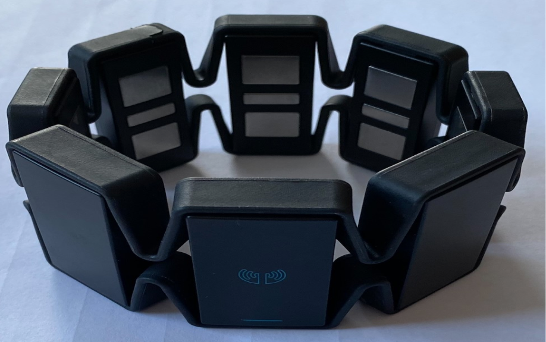
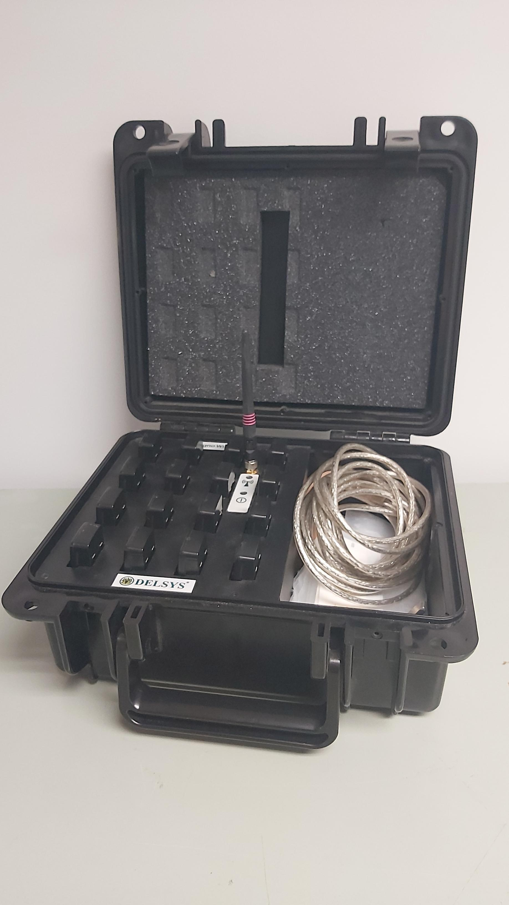
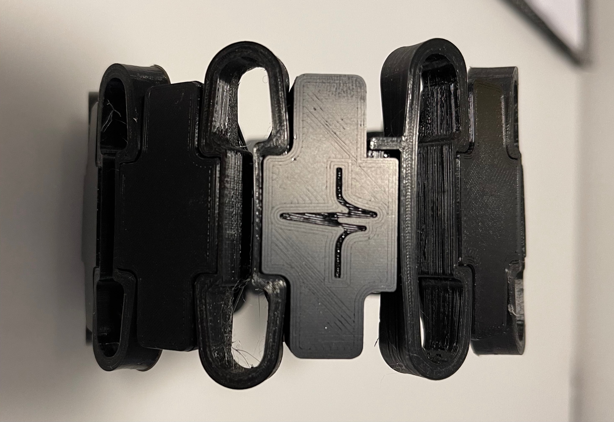

<style>
    table {
        width: 100%;
    }
    .device_img {
        display: block;
        margin-left: auto;
        margin-right: auto;
        width: 50%;
        height: 50%;
    }
    .device_img_2 {
        display: block;
        margin-left: auto;
        margin-right: auto;
        width: 35%;
        height: 50%;
    }
</style>

This module has three data-related functions: **(1) Datasets**, **(2) Offline Data Handling**, and **(3) Online Data Handling**. Together, they correspond to most of the data-related functionality one would ever need for leveraging validated datasets, parsing through file structures of offline data, and processing real-time EMG.

# Datasets
To give all interested parties the ability to leverage our library, we have included several validated datasets as part of this library. These datasets can be leveraged for exploring the library's capabilities and, additionally, for future research. We ask that for the latter, please correctly reference the dataset in your work. Note, these datasets will be downloaded locally when used.

<details>
<summary><b>OneSubjectMyoDataset</b></summary>

| Attribute          | Description |
| ------------------ | ----------- |
| **Num Reps:**      | 3 Training, 3 Testing       |
| **Time Per Rep:**      | 3s      |
| **Classes:**       | <ul><li>0 - Hand Open</li><li>1 - Hand Close</li><li>2 - No Movement</li><li>3 - Wrist Extension</li><li>4 - Wrist Flexion</li></ul>       |
| **Device:**        | Myo        |
| **Sampling Rates:** | EMG (200 Hz)        |
| **Continuous:**    | False |

**Using the Dataset:**
```Python
dataset = OneSubjectMyoDataset(redownload=False)
odh = dataset.prepare_data()
```
-------------
</details>

<br>

<details>
<summary><b>3DCDatset</b></summary>

| Attribute          | Description |
| ------------------ | ----------- |
| **Num Reps:**      | 4 Training, 4 Testing       |
| **Time Per Rep:**      | 5s      |
| **Classes:**       | <ul><li>0 - No Motion</li><li>1 - Radial Deviaton</li><li>2 - Wrist Flexion</li><li>3 - Ulnar Deviaton</li><li>4 - Wrist Extension</li><li>5 - Supination</li><li>6 - Pronation</li><li>7 - Power Grip</li><li>8- Open Hand</li><li>9 - Chuck Grip</li><li>10 - Pinch Grip</li></ul>       |
| **Device:**        | Delsys        |
| **Sampling Rates:** | EMG (1000 Hz)        |
| **Continuous:**    | False |

**Using the Dataset:**
```Python
dataset = _3DCDataset(redownload=False)
odh = dataset.prepare_data()
```

**References:**
```
@article{cote2019deep, title={Deep learning for electromyographic hand gesture signal classification using transfer learning}, author={C{^o}t{'e}-Allard, Ulysse and Fall, Cheikh Latyr and Drouin, Alexandre and Campeau-Lecours, Alexandre and Gosselin, Cl{'e}ment and Glette, Kyrre and Laviolette, Fran{\c{c}}ois and Gosselin, Benoit}, journal={IEEE transactions on neural systems and rehabilitation engineering}, volume={27}, number={4}, pages={760--771}, year={2019}, publisher={IEEE} }

@article{cote2020interpreting, title={Interpreting deep learning features for myoelectric control: A comparison with handcrafted features}, author={C{^o}t{'e}-Allard, Ulysse and Campbell, Evan and Phinyomark, Angkoon and Laviolette, Fran{\c{c}}ois and Gosselin, Benoit and Scheme, Erik}, journal={Frontiers in Bioengineering and Biotechnology}, volume={8}, pages={158}, year={2020}, publisher={Frontiers Media SA} }
```
-------------

<!-- ## Fougner

Short Description.

| Attribute          | Description |
| ------------------ | ----------- |
| **Num Reps:**      | |
| **Time Per Rep:**  | |
| **Classes:**       | |
| **Device:**        | |
| **Sampling Rates:** | |
| **Continuous:**    | |
| **Repo:**          | |

**Using the Dataset:**
```Python
# TODO: Add example
```

**References:**
```
Fougner A, Scheme E, Chan AD, Englehart K, Stavdahl O. Resolving the limb position effect in myoelectric pattern recognition. IEEE Trans Neural Syst Rehabil Eng. 2011 Dec;19(6):644-51. doi: 10.1109/TNSRE.2011.2163529. Epub 2011 Aug 15. PMID: 21846608.
```

## Radmand

Short Description.

| Attribute          | Description |
| ------------------ | ----------- |
| **Num Reps:**      | |
| **Time Per Rep:**  | |
| **Classes:**       | |
| **Device:**        | |
| **Sampling Rates:** | |
| **Continuous:**    | |
| **Repo:**          | |

**Using the Dataset:**
```Python
# TODO: Add example
```

**References:**
```
Radmand A, Scheme E, Englehart K. A characterization of the effect of limb position on EMG features to guide the development of effective prosthetic control schemes. Annu Int Conf IEEE Eng Med Biol Soc. 2014;2014:662-7. doi: 10.1109/EMBC.2014.6943678. PMID: 25570046.
```
-----------

## Scheme_1

Contraction Intensity.

| Attribute          | Description |
| ------------------ | ----------- |
| **Num Reps:**      | |
| **Time Per Rep:**  | |
| **Classes:**       | |
| **Device:**        | |
| **Sampling Rates:** | |
| **Continuous:**    | |
| **Repo:**          | |

**Using the Dataset:**
```Python
# TODO: Add example
```

**References:**
```
Scheme E, Englehart K. Training Strategies for Mitigating the Effect of Proportional Control on Classification in Pattern Recognition Based Myoelectric Control. J Prosthet Orthot. 2013 Apr 1;25(2):76-83. doi: 10.1097/JPO.0b013e318289950b. PMID: 23894224; PMCID: PMC3719876.
```
-------------

## Scheme_2

1v1 Online.

| Attribute          | Description |
| ------------------ | ----------- |
| **Num Reps:**      | |
| **Time Per Rep:**  | |
| **Classes:**       | |
| **Device:**        | |
| **Sampling Rates:** | |
| **Continuous:**    | |
| **Repo:**          | |

**Using the Dataset:**
```Python
# TODO: Add example
```

**References:**
```
E. J. Scheme and K. B. Englehart, "Validation of a Selective Ensemble-Based Classification Scheme for Myoelectric Control Using a Three-Dimensional Fitts' Law Test," in IEEE Transactions on Neural Systems and Rehabilitation Engineering, vol. 21, no. 4, pp. 616-623, July 2013, doi: 10.1109/TNSRE.2012.2226189.
```
-------------

## Scheme_3

Confidence Rejection.

| Attribute          | Description |
| ------------------ | ----------- |
| **Num Reps:**      | |
| **Time Per Rep:**  | |
| **Classes:**       | |
| **Device:**        | |
| **Sampling Rates:** | |
| **Continuous:**    | |
| **Repo:**          | |

**Using the Dataset:**
```Python
# TODO: Add example
```

**References:**
```
E. J. Scheme, B. S. Hudgins and K. B. Englehart, "Confidence-Based Rejection for Improved Pattern Recognition Myoelectric Control," in IEEE Transactions on Biomedical Engineering, vol. 60, no. 6, pp. 1563-1570, June 2013, doi: 10.1109/TBME.2013.2238939.
```
-----------

## Scheme_4

Continuous Transitions.

| Attribute          | Description |
| ------------------ | ----------- |
| **Num Reps:**      | |
| **Time Per Rep:**  | |
| **Classes:**       | |
| **Device:**        | |
| **Sampling Rates:** | |
| **Continuous:**    | |
| **Repo:**          | |

**Using the Dataset:**
```Python
# TODO: Add example
```

**References:**
```
E. Campbell, A. Phinyomark and E. Scheme, "Linear Discriminant Analysis with Bayesian Risk Parameters for Myoelectric Control," 2019 IEEE Global Conference on Signal and Information Processing (GlobalSIP), 2019, pp. 1-5, doi: 10.1109/GlobalSIP45357.2019.8969237.
```
-----------

## Scheme_5

Proportional Control.

| Attribute          | Description |
| ------------------ | ----------- |
| **Num Reps:**      | |
| **Time Per Rep:**  | |
| **Classes:**       | |
| **Device:**        | |
| **Sampling Rates:** | |
| **Continuous:**    | |
| **Repo:**          | |

**Using the Dataset:**
```Python
# TODO: Add example
```

**References:**
```
E. Scheme, B. Lock, L. Hargrove, W. Hill, U. Kuruganti and K. Englehart, "Motion Normalized Proportional Control for Improved Pattern Recognition-Based Myoelectric Control," in IEEE Transactions on Neural Systems and Rehabilitation Engineering, vol. 22, no. 1, pp. 149-157, Jan. 2014, doi: 10.1109/TNSRE.2013.2247421.
```
----------

## Nawfel_1

Feedback.

| Attribute          | Description |
| ------------------ | ----------- |
| **Num Reps:**      | |
| **Time Per Rep:**  | |
| **Classes:**       | |
| **Device:**        | |
| **Sampling Rates:** | |
| **Continuous:**    | |
| **Repo:**          | |

**Using the Dataset:**
```Python
# TODO: Add example
```

**References:**
```
J. L. Nawfel, K. B. Englehart and E. J. Scheme, "A Multi-Variate Approach to Predicting Myoelectric Control Usability," in IEEE Transactions on Neural Systems and Rehabilitation Engineering, vol. 29, pp. 1312-1327, 2021, doi: 10.1109/TNSRE.2021.3094324.
```
----------

## Robertson_1

Rejection 1.

| Attribute          | Description |
| ------------------ | ----------- |
| **Num Reps:**      | |
| **Time Per Rep:**  | |
| **Classes:**       | |
| **Device:**        | |
| **Sampling Rates:** | |
| **Continuous:**    | |
| **Repo:**          | |

**Using the Dataset:**
```Python
# TODO: Add example
```

**References:**
```
Robertson JW, Englehart KB, Scheme EJ. Rejection of Systemic and Operator Errors in a Real-Time Myoelectric Control Task. Annu Int Conf IEEE Eng Med Biol Soc. 2018 Jul;2018:5640-5643. doi: 10.1109/EMBC.2018.8513529. PMID: 30441615.
```
----------

## Robertson_2

Rejection 2.

| Attribute          | Description |
| ------------------ | ----------- |
| **Num Reps:**      | |
| **Time Per Rep:**  | |
| **Classes:**       | |
| **Device:**        | |
| **Sampling Rates:** | |
| **Continuous:**    | |
| **Repo:**          | |

**Using the Dataset:**
```Python
# TODO: Add example
```

**References:**
```
Robertson JW, Englehart KB, Scheme EJ. Effects of Confidence-Based Rejection on Usability and Error in Pattern Recognition-Based Myoelectric Control. IEEE J Biomed Health Inform. 2019 Sep;23(5):2002-2008. doi: 10.1109/JBHI.2018.2878907. Epub 2018 Oct 31. PMID: 30387754.
```
----------

## Raghu_1

Continuous Transitions.

| Attribute          | Description |
| ------------------ | ----------- |
| **Num Reps:**      | |
| **Time Per Rep:**  | |
| **Classes:**       | |
| **Device:**        | |
| **Sampling Rates:** | |
| **Continuous:**    | |
| **Repo:**          | |

**Using the Dataset:**
```Python
# TODO: Add example
```

**References:**
```
Shriram Tallam Puranam Raghu, Dawn MacIsaac, Erik Scheme, Analyzing the impact of class transitions on the design of pattern recognition-based myoelectric control schemes, Biomedical Signal Processing and Control, Volume 71, Part A, 2022, 103134, ISSN 1746-8094, https://doi.org/10.1016/j.bspc.2021.103134.
```

## GRABMyo

Forearm and wrist dataset consisting of 16 hand and finger gestures over 3 seperate days.

| Attribute          | Description |
| ------------------ | ----------- |
| **Num Reps:**      |     |
| **Time Per Rep:**      |      |
| **Classes:**       |  |
| **Device:**        |    |
| **Sampling Rates:** |         |
| **Continuous:**    | |
| **Repo:**          | https://physionet.org/content/grabmyo/1.0.2/ |

**Using the Dataset:**
```Python
# Add example
```

**References:**
```
Jiang, N., Pradhan, A., & He, J. (2022). Gesture Recognition and Biometrics ElectroMyogram (GRABMyo) (version 1.0.2). PhysioNet. https://doi.org/10.13026/dzhr-nj10.

Pradhan, A., He, J. & Jiang, N. Multi-day dataset of forearm and wrist electromyogram for hand gesture recognition and biometrics. Sci Data 9, 733 (2022).

Goldberger, A., Amaral, L., Glass, L., Hausdorff, J., Ivanov, P. C., Mark, R., ... & Stanley, H. E. (2000). PhysioBank, PhysioToolkit, and PhysioNet: Components of a new research resource for complex physiologic signals. Circulation [Online]. 101 (23), pp. e215–e220.
```
------------- -->

</details>
<br/>

# Offline Data Handler 
A significant overhead in projects is simply interfacing with a particular dataset. We provide a means to quickly interface your in-house or public datasets with the library so you can get to improving performance as fast as possible. The offline data handler is incredibly flexible with the format of the data. Simply specify the base directory and it will capture all .csv and .txt files in nested folders. There can be important metadata in the file addresses that are crucial for later analysis (i.e., extracting a training set flag, subject number, repetition number, and class number from a file named `C:\User\CoolProgrammer\Dataset\training\S1_C12_R3.txt`), and we provide a simple function for defining regular expressions for all the metadata you could desire. Using these regular expressions, you can create a dictionary that you pass into the OfflineDataHandler that will collect the metadata along with the EMG contents within the files for all files that satisfy your regex. If the metadata is within the file, you can alternatively hand in a column id for the metadata. Once the data handler has collected all the information available, you can use it to slice the dataset however you'd like, then proceed through the rest of the pipeline!

```Python
dataset_folder = 'demos/data/myo_dataset'
sets_values = ["training", "testing"]
sets_regex = make_regex(left_bound = "dataset/", right_bound="/", values = sets_values)
classes_values = ["0","1","2","3","4"]
classes_regex = make_regex(left_bound = "_C_", right_bound="_EMG.csv", values = classes_values)
reps_values = ["0","1","2","3"]
reps_regex = make_regex(left_bound = "R_", right_bound="_C_", values = reps_values)
dic = {
    "sets": sets_values,
    "sets_regex": sets_regex,
    "reps": reps_values,
    "reps_regex": reps_regex,
    "classes": classes_values,
    "classes_regex": classes_regex
}
odh = OfflineDataHandler()
odh.get_data(folder_location=dataset_folder, filename_dic = dic, delimiter=",")
train_odh = odh.isolate_data(key="sets", values=[1])
train_windows, train_metadata = train_odh.parse_windows(50,25)
fe = FeatureExtractor()
feature_list = fe.get_feature_list()
training_features = fe.extract_features(feature_list, train_windows)
```

# Online Data Handler 

One of the major complications in interfacing with EMG devices is that they are all unique. The goal of this library was to abstract these differences and enable a hardware-agnostic framework. To handle these differences, this module acts as a middle layer for processing data from any device streaming data. In this architecture - exemplified in Figure 1 - the OnlineDataHandler reads data from a UDP port. Once data is read, it is passed through the system and is processed equivalently for any hardware. This means that the `UDP streamer` and `OnlineDataHandler` are mutually independent of each other as they communicate over a specified UDP port. Both run in their own processes, so the main thread is never blocked.


<center> <p> Figure 1: OnlineDataHandler Architecture</p> </center>

The typical setup for any problem is exemplified in the code snippet below. The order in which the `OnlineDataHandler` and the `streamer` get created does not matter (as they are independent). The only important thing to note is that both must be initialized before you can do anything with the data. 

```Python
# Create Online Data Handler - This listens for data 
odh = OnlineDataHandler()
odh.start_listening()
# Create UDP Streamer - This streams data 
[preferred]_streamer()
# Do something with the data... 
```

## Visualizations
We have added some convenient functionality to the `OnlineDataHandler` to help developers. Firstly, we have added two visualize functions: `visualize` and `visualize_channels`, exemplified in Table 1.

| <center>Combined</center>  | <center>All Channels</center> |
| ------------- | ------------- |
|   |    |
<center> <p> Table 1: Raw Data from the <b>OnlineDataHandler</b></p> </center>

## Inspecting Hardware
Additionally, we have added a function `analyze_hardware` to run a simple analysis on the hardware device being used. This is a good way to sanity check that your device is working as expected. Example output from this function for the Myo Armband is:

```
Starting analysis (10s)... We suggest that you elicit varying contractions and intensities to get an accurate analysis.
Sampling Rate: 200
Num Channels: 8
Max Value: 127
Min Value: -128
Resolution: 8 bits
Time Between Samples - Mean: 0.005005508407569851s STD: 0.007183463266367916s
Repeating Values: 0
```

- `sampling rate` is the number of samples read per second.
- `num channels` is the number of channels being read.
- `min and max values` are the maximum values read from the data.
- `resolution` is the predicted resolution in bits based on the data seen.
- `time between_samples` is the average and standard deviation between sample reads. 
- `repeating values` is the number of repeated values in the input data. Repeating values of > 0 indicate that there might be some issues.

## Using Prebuilt Streamers
Additionally, we have added a streamer module that makes creating the `UDP Streamer` much easier. We have included streamers for a variety of common EMG devices shown in Table 2. Reference the <b>streamers API</b> for further information.

| <center>Hardware</center> | <center>Function</center> | <center>Image</center> |
| ------------- | ------------- | ------------- |
| Myo Armband  | `myo_streamer()`  | <div class="device_img"> </div>|
| Delsys  | `delsys_streamer()` | <div class="device_img_2"> </div>|
| SIFI Cuff | `sifi_streamer()` | <div class="device_img"> </div>|

<center> <p>Table 2: The list of all implemented streamers.</p> </center>

## Creating Custom Streamers
We understand that there will be times when developers are using non-standard hardware. Conveniently, our architecture is hardware agnostic so that developers can write their own UDP streamers. A UDP streamer reads a value from a device, pickles it, and sends it over UDP - the `OnlineDataHandler` takes care of the rest. An example streamer for the Myo Armband is shown below:

```Python
import socket
import multiprocessing
import pickle
from pyomyo import Myo, emg_mode

def streamer():
    sock = socket.socket(socket.AF_INET, socket.SOCK_DGRAM)
    m = Myo(mode=emg_mode.FILTERED)
    m.connect()

    # On every new sample it, simply pickle it and write it over UDP
    def write_to_socket(emg, movement):
        data_arr = pickle.dumps(list(emg))
        sock.sendto(data_arr, ('127.0.0.1' 12345))
    m.add_emg_handler(write_to_socket)
    
    while True:
        m.run()
        
if __name__ == "__main__" :
    # Create streamer in a seperate Proces so that the main thread is free
    p = multiprocessing.Process(target=streamer, daemon=True)
    p.start()
    
    # Code leveraging the data goes here:
    odh = OnlineDataHandler(emg_arr=True, port=12345, ip='127.0.0.1')
    odh.start_listening()

    # Do stuff with data...
```
<center> <p> Figure 2: Example of an EMG Streamer for the Myo Armband</p> </center>
