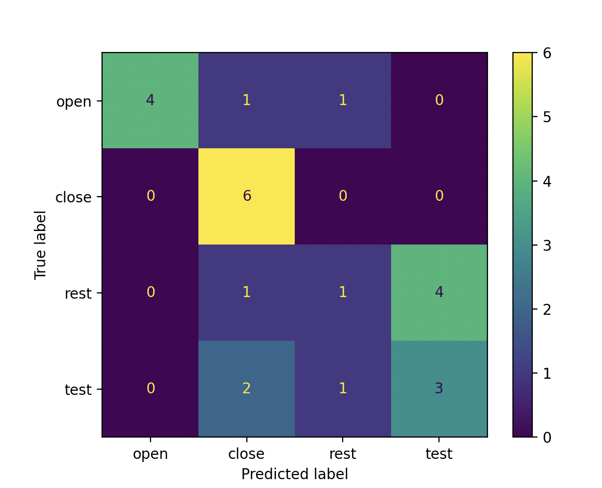

Evaluation techniques for myoelectric control can primarily be divided into two categories: **online** and **offline** evaluation. In this section, we present the two different techniques, explore when each should be used, and provide suggestions on the best evaluation standards for a given project. 

## Offline Evaluation 
Offline evaluation involves testing a model using pre-recorded data by leveraging several offline metrics. While these metrics do not necessarily correlate to online usability, they provide insight into the potential performance of a control system. Additionally, they are valuable for evaluating hyperparameters and exploring different algorithms. The following code snippet shows how easy it is to extract offline metrics from a set of predictions and ground truth labels.

```Python
import numpy as np
from unb_emg_toolbox.offline_metrics import OfflineMetrics

if __name__ == "__main__" :
    y_true = np.array([0,0,0,0,0,0,1,1,1,1,1,1,2,2,2,2,2,2,3,3,3,3,3,3])
    y_preds = np.array([1,0,0,0,0,2,1,1,1,1,1,1,1,2,3,3,3,3,1,1,2,3,3,3])

    om = OfflineMetrics()

    # Get and extract all available metrics:
    metrics = om.get_available_metrics()
    offline_metrics = om.extract_offline_metrics(metrics=metrics, y_true=y_true, y_predictions=y_preds, null_label=2)
    print(offline_metrics)

    # Get and extract a subset of metrics:
    metrics = ['AER', 'CA', 'INS']
    offline_metrics = om.extract_offline_metrics(metrics=metrics, y_true=y_true, y_predictions=y_preds, null_label=2)
    print(offline_metrics)
```


### **Classification Accuracy (CA)** 
The percentage of correctly predicted samples. While this is a common evaluation metric, it does not necessarily correlate to online usability.

$
\text{CA} = \frac{1}{N}\sum_{i=1}^{N}\hat{y}_{i} == {y}_{i}
$

where $N$ is the total number of data frames/predictions, $\hat{y}_{i}$ is the predicted class label for frame $i$, and $y_{i}$ is the true class label for frame i.

### **Active Error (AER)** 
The percentage of incorrect predictions,  ignoring No Movement predictions. This metric evaluates the performance of a classifier on active class decisions. This is valuable as the No Movement class typically correlates to "do nothing" functionality. 

$
\text{AER} = \frac{1}{N}\sum_{i=1}^{N}\hat{y}_{i} \ne {y}_{i} \space \text{and} \space \hat{y}_{i} \ne y_{NM}
$

where $N$ is the total number of data frames/predictions, $\hat{y}_{i}$ is the predicted class label for frame $i$, $y_{i}$ is the true class label for frame i, and $y_{NM}$ is the no movement/null class.

### **Instability (INS)**
The number of times that subsequent predictions differ, normalized by the total number of predictions. This metric provides insight into the stability of a classifier (i.e., lack of fluctuating predictions). 

$
\text{INS} = \frac{1}{N}\sum_{i=2}^{N}\hat{y}_{i} \ne \hat{y}_{i-1}
$

where $N$ is the total number of data frames/predictions, and $\hat{y}_{i}$ is the predicted class label for frame $i$.

### **Confusion Matrix (CONF_MAT)**
A confusion Matrix is a $C$ x $C$ matrix, where $C$ is the number of classes. Each row of the matrix represents the true label, and each column represents the predicted label. This matrix provides valuable insight into what classes get confused with others.

<style>
    img {
        width: 30%;
        display: block;
        margin-left: auto;
        margin-right: auto;
    }
</style>


### **Recall (RECALL)**
TODO: Evan

$
\text{RECALL} = \frac{TP}{(FN + TP)}
$

where $TP$ is the number of true positives, and $FN$ is the number of false negatives.

### **Precision (PREC)**
TODO: Evan

$
\text{PREC} = \frac{TP}{(FP + TP)}
$

where $TP$ is the number of true positives, and $FP$ is the number of false positives.

### **F1 Score (F1)**
TODO: Evan

$
\text{F1} = 2 \times \frac{(Precision \times Recall)}{Precision + Recall}
$

### **Reliability (RELIAB)** 
TODO: Evan

### **Rejection Rate (REJ_RATE)**
For control systems leveraging rejection, this metric corresponds to the percentage of rejected decisions. This gives insight into whether the system is over or under-rejecting. 

$
\text{REJ_RATE} = \frac{1}{N}\sum_{i=1}^{N}\hat{y}_{i} == y_{rej}
$

where $N$ is the total number of data frames/predictions, $\hat{y}_{i}$ is the predicted class label for frame $i$, and $y_{rej}$ is the rejection label (default = -1).

## Online Evaluation 
Online evaluation involves user-in-the-loop interaction, meaning that users get real-time feedback as they interact with the control system. One common form of online evaluation in the prosthetics community involves leveraging Fitts law tests <sup>1</sup>. Check out our [second example](../../examples/fitts_example/fitts.md) if you are interested. This is common as prosthetic devices are expensive, and fittings are complicated. However, for more generic use cases, online evaluation should involve interaction between the users and the designed application. For control system evaluation in an online setting, the **OnlineEMGClassifier** module should be leveraged.

# References
<a id="1">[1]</a> 
Scheme EJ, Englehart KB. Validation of a selective ensemble-based classification scheme for myoelectric control using a three-dimensional Fitts' Law test. IEEE Trans Neural Syst Rehabil Eng. 2013 Jul;21(4):616-23. doi: 10.1109/TNSRE.2012.2226189. Epub 2012 Oct 25. PMID: 23193252.