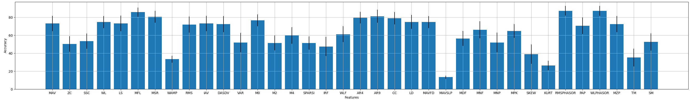

The goal of this module is to simplify the feature extraction stage for developers. We have included approximately 30 popular features from the literature that we have robustly tested and validated. The following code snippet exemplifies how simple feature extraction from raw EMG is leveraging this module:

```Python
import numpy as np
from libemg.feature_extractor import FeatureExtractor
from libemg.utils import get_windows

fe = FeatureExtractor()

# Load data from a csv file:
data = np.loadtxt("emg_data.csv", delimiter=",")
# Split the raw EMG into windows 
windows = get_windows(data, 50, 25)

# Extract a list of features
feature_list = ['MAV', 'SSC', 'ZC', 'WL']
features_1 = fe.extract_features(feature_list, windows)

# Extract a predfined feature group
features_2 = fe.extract_feature_group('HTD', windows)
```

# Feature Performance
We currently have 35 features installed in the library. These features were tested individually with a linear discriminant analysis classifier on the 3DC dataset and achieve a wide range of accuracies. Note: some of these features are designed to improve robustness to factors (i.e., power line interference, limb position effect, contraction intensity variability), and as a result don't achieve high accuracy on their own for this gesture recognition task. Do not discount their value when used in a rounded feature set for a real-world task. The code associate with Figure 1 is located <a href="#code">below</a>.


<center> <p> Figure 1: Individual Feature Accuracy</p> </center>

# Implemented Features
Let $x_{i}$ represents the signal in segment i and $N$ denotes the number of samples in the timeseries.

Let $fj$ be the frequency of the spectrum at frequency bin $j$, $P_{j}$ is the
EMG power spectrum at frequency bin $j$, and $M$ is the length of the frequency bin.

**Note: every feature and feature group is associated with an abbreviation (e.g., MAV). This is how we refer to a specific feature in our library and is how you should interface with it.**

## **Mean Absolute Value (MAV)** <sup>[1]</sup>

The average of the absolute value of the EMG signal. This is one of the most commonly used features for EMG.

$
\text{MAV} = \frac{1}{N}\sum_{i=1}^{N} |x_{i}|
$

## **Zero Crossings (ZC)** <sup>[1]</sup>
The number of times that the amplitude of the EMG signal crosses a zero amplitude threshold. 

$
\text{ZC} = \sum_{i=1}^{N-1}[\text{sgn}(x_{i} \times x_{i+1}) \cap |x_{i} - x_{i+1}| \ge \text{threshold}] 
$

$
\text{sgn(}x\text{)} = \left\{\begin{array}{lr}
    1, & \text{if } x \ge \text{threshold} \\
    0, & \text{otherwise }
    \end{array}\right\}
$

## **Slope Sign Change (SSC)** <sup>[1]</sup>
The number of times that the slope of the EMG signal changes (i.e., the number of times that it changes between positive and negative). 

$
\text{SSC} = \sum_{i=2}^{N-1}[f[(x_{i} - x_{i-1}) \times (x_{i} - x_{i+1})]] \\
$

$
f(x) = \left\{\begin{array}{lr}
    1, & \text{if } x \ge \text{threshold} \\
    0, & \text{otherwise }
    \end{array}\right\}
$

## **Waveform Length (WL)** <sup>[1]</sup>
The cumulative length of the EMG waveform over the passed in window. This feature is used to measure the overall complexity of the signal (i.e., higher WL means more complex).

$
\text{WL} = \sum_{i=1}^{N-1}|x_{i+1} - x_{i}|
$

## **L-score (LS)** <sup>[2]</sup>
A feature that uses the Legendre Shift Polynomial.

$
\text{LS} = \sum_{i=1}^{N} \text{LSP} * B
$

## **Maximum Fractal Length (MFL)** <sup>[3]</sup>
A nonlinear information feature for the EMG waveform that is relatively invariant to contraction intensity.

$
\text{MFL} = log_{10} \sum_{i=1}^{N-1}  | x_{i+1} - x_{i} |
$

## **Mean Squared Ratio	(MSR)** <sup>[4]</sup>
Determines the total amount of activity in a window.

$
\text{MSR} = \frac{1}{N}\sum_{i=1}^{N}(x_{i})^{\frac{1}{2}}
$

## **Willison Amplitude (WAMP)** <sup>[1]</sup>
The number of times that there is a difference between amplitudes of two seperate samples exceeding a pre-defined threshold. This feature is related to the firing of motor unit action potentials and muscle contraction force.

$
\text{WAMP} = \sum_{i=1}^{N-1}[f(|x_{n}-x_{n+1})] \\
$

$    
f(x) = \left\{\begin{array}{lr}
    1, & \text{if } x \ge \text{threshold} \\
    0, & \text{otherwise }
    \end{array}\right\}
$

## **Root Mean Square (RMS)** <sup>[1]</sup>
Models the signal as an amplitude modulated Gaussian random process that relates to constant force and non-fatiguing contraction.

$
\text{RMS} = \sqrt{\frac{1}{N}\sum_{i=1}^{N}x_{i}^{2}}
$

## **Integral of Absolute Value (IAV)** <sup>[1]</sup>
The integral of the absolute value. Also known as IEMG.

$
\text{IAV} = \sum_{i=i}^{N} |x_{i}|
$

## **Difference Absolute Standard Deviation Value (DASDV)** <sup>[1]</sup>
Standard deviation of the wavelength.

$
\text{DASDV}=\sqrt{\frac{1}{N-1}\sum_{i=1}^{N-1} (x_{i+1} - x_{i})^2} 
$

## **Variance (VAR)** <sup>[5]</sup>
Calculates the variance of the data.

$
\text{VAR} = \frac{1}{N-1}\sum_{i=1}^{N} (x_{i}^{2} - \mu _x)
$

## **First Temporal Moment (M0)** <sup>[6]</sup>
A commonly-used feature part of the TDPSD feature set.

$
\text{M0} = log(\frac{\sqrt{\sum_{i=1}^{N}x_{i}^2}^{0.1}}{0.1})
$

## **Second Temporal Moment (M2)** <sup>[6]</sup>
A commonly-used feature part of the TDPSD feature set.

$
\text{M2} = log(\frac{\sqrt{\sum_{i=1}^{N-1}(x_{i+1} - x_{i})^2)}^{0.1}}{0.1})
$

## **Fourth Temporal Moment (M4)** <sup>[6]</sup>
A commonly-used feature part of the TDPSD feature set.

$
\text{M4} = log(\frac{\sqrt{\sum_{i=1}^{N-2}(x_{i+2} + x_{i})^2)}^{0.1}}{0.1})
$


## **Sparsness (SPARSI)** <sup>[6]</sup>
A commonly-used feature part of the TDPSD feature set.

$
\text{SPARSI} = log( |\frac{\text{M0}}{\sqrt{ | \text{M0}-\text{M2} | }\sqrt{ | \text{M0}-\text{M4} | }} |)
$

## **Irregularity Factor (IRF)** <sup>[6]</sup>
A commonly-used feature part of the TDPSD feature set.

$
\text{IRF} = log ( | \frac{\text{M2}}{\sqrt{ | \text{M0}*\text{M4} | }} | )
$

## **Waveform Length Factor (WLR)** <sup>[6]</sup>
A commonly-used feature part of the TDPSD feature set.

$
\text{WLR} = log (\sum_{i=1}^{N-1} | x_{i+1} - x_{i} | / \sum_{i=1}^{N-2} | x_{i+2} + x_{i} |)
$

## **Autoregressive Coefficients (AR4 and AR9)** <sup>[1]</sup>
For order r, the autoregressive coefficient can be calculated by: **

$
\text{AR}_{r} = \sum_{i=1}^{N-r} x_{i+r}*x_{i}
$

## **Cepstral Coefficient (CC)**
For order r, the cepstral coefficient can be calculated by:

$
\text{CC}_{1}= -\text{AR}_{1} \\
$

$
\text{CC}_{r}= \sum_{i=1}^{r} \frac{r-i}{r} \text{AR}_{r} *\text{CC}_{r-2} 
$


## **Log Detector (LD)** <sup>[1]</sup>
Provides an estimate of the muscle contraction force.

$
\text{LD} = e^{\frac{1}{N}\sum_{i=1}^{N} log(|x_{i}|)}
$

## **Mean Absolute Value First Difference (MAVFD)**
Gets the mean absolute value of the slope of the signal.

$
\text{MAVFD} = \sum_{i=1}^{N-1} \frac{x_{i+1}-x_{i}}{N-1}
$

## **Mean Absolute Value Slope (MAVSLP)** <sup>[1]</sup>
Get the slope between p sections within a window. Here demonstrated for p=2.

$
\text{MAVSLP}_{p} = \sum_{i=\frac{N}{p} + 1}^{N} \frac{|x_{i}|}{(\frac{N}{P})} - \sum_{j=1}^{\frac{N}{p}}\frac{|x_{j}|}{(\frac{N}{P})}
$

## **Median Frequency (MDF)** <sup>[1]</sup>
Frequency at which the EMG spectrum is divided into 2 portions with equal amplitude.

$
\text{MDF} = \frac{1}{2}\sum_{j=1}^{M}{P_{j}}
$

## **Mean Frequency (MNF)** <sup>[1]</sup>
Computes the average frequency of the EMG spectrum.

$
\text{MNF} = (\sum_{j=1}^{M}{f_{j}P_{j}})/(\sum_{j=1}^{M}{P_{j}})
$

## **Mean Power (MNP)** <sup>[1]</sup>
Computes the average power of the EMG spectrum.

$
\text{MNP} = \frac{1}{M}\sum_{j=1}^{M}P_{j}
$

## **Maximum/Peaks (MPK) <sup>[1]</sup>**
A feature that records the highest amplitude within the window:

$
\text{MPK} = max(x)
$

## **Skewness (SKEW)** <sup>[7]</sup>
Characterizes the degree of asymmetry in the distribution of a variable.

$
\text{SKEW} = (\frac{1}{N}\sum_{i=1}^{N}(x_i-\mu)^3) / (\sqrt{(\frac{1}{N}\sum_{i=1}^{N}(x_i-\mu)^2)})
$

## **Kurtosis (KURT)** <sup>[7]</sup>
Indicates non-gaussianity and used to identify the peakedness of a distribution.

$
\text{KURT} = [(\frac{1}{N}\sum_{i=1}^{N}{x_{i}^4})/(\frac{1}{N}\sum_{i=1}^{N}{x_{i}^2})^2] - 3
$

## **Root Mean Squared Phasor (RMSPHASOR)** <sup>[12]</sup>
A feature that computes all channel-wise differences in RMS values and incorporates spatial resolution to get the predominant directions of RMS and the derivative of RMS. $RMSi_{c}$ refers to the complex-valued spatial RMS of channel i. $dRMSi_{c}$ refers to the same complex-valued spatial RMS computed on the derivative of the channel i signal. This feature set returns (N)(N-1)/2 RMSPHASOR features and (N)(N-1)/2 dRMSPHASOR features for a total of (N)(N-1) features for N channels.

$
\text{RMSPHASOR_{i,j}} = \text{log}(\text{norm}(RMSi_{c} - RMSj_{c}))
$
$
\text{dRMSPHASOR_{i,j}} = \text{log}(\text{norm}(dRMSi_{c} - dRMSj_{c}))
$

## **Waveform Length Phasor (WLPHASOR)** <sup>[12]</sup>
A feature that computes all channel-wise differences in WL values and incorporates spatial resolution to get the predominant directions of WL and the derivative of WL. $WLi_{c}$ refers to the complex-valued spatial WL of channel i. $dWL_{c}$ refers to the same complex-valued spatial WL computed on the derivative of the channel i signal.
This feature set returns (N)(N-1)/2 WLPHASOR features and (N)(N-1)/2 dWLPHASOR features for a total of (N)(N-1) features for N channels.

$
\text{WLPHASOR_{i,j}} = \text{norm}(WLi_{c} - WLj_{c})
$
$
\text{dWLPHASOR_{i,j}} = \text{norm}(dWLi_{c} - dWLj_{c})
$

## **Peak Average Power (PAP)** <sup>[13]</sup>
A peak average power computation using the time domain spectral moment computation method commonly used across the TDPSD feature set. The 0th, 2nd, and 4th order moments are used to compute PAP using the following equation:

$
\text{PAP} = \frac{M0}{M4/M2}
$

## **Multiplication of Peaks (MZP)** <sup>[13]</sup>
A spectral peak product using the time domain spectral moment computation method commonly used across the TDPSD feature set. The 2nd, and 4th order moments are used to compute PAP using the following equation:

$
\text{MZP} = \sqrt(\frac{M4}{M2})
$


## **Temporal Moment (TM)** <sup>[1]</sup>
A temporal moment feature computed directly from the time domain. An order parameter is passed in that scales the signal prior to computing the moments. The zeroth order moment is the windowsize, the first order moment is like the MAV, and the second order moment is like the variance;therefore the feature should be used with order > 3 (this is set as the default).

$
\text{TM} =  \sum_{i=1}^{N} |x_{i}^{order}|
$

## **Spectral Moment (SM)** <sup>[1]</sup>
A spectral moment feature computed from the frequency domain. An order parameter is passed in that scales the signal prior to computing the moments. POW is the power spectrum of the signal and f is the frequencies associated with every sample of the power spectrum.

$
\text{SM} =  \sum_{i=1}^{F} pow_{i}*f_{i}^{order}
$

# Feature Sets
Feature sets are validated groups of features that have been shown empirically to perform well for EMG-related classification tasks. The following feature sets are common groupings that are implemented in the library:

## **Hudgin's Time Domain (HTD)** <sup>[8]</sup>
1. Mean Absolute Value (MAV)
2. Zero Crossings (ZC)
3. Slope Sign Change (SSC)
4. Waveform Length (WL)

## **Low Sampling Frequency 4 (LS4)** <sup>[2]</sup>
1. L-Score (LS)
2. Maximum Fractal Length (MFL)
3. Mean Squared Ratio (MSR)
4. Willison Amplitude (WAMP)

## **Low Sampling Frequency 9 (LS9)** <sup>[2]</sup>
1. TD4 Features 
2. Zero Crossings (ZC)
3. Root Mean Square (RMS)
4. Integral of the Absolute Value (IAV) 
5. Absolute Square Average Difference Value (DASDV)
6. Variance (VAR)

## **Time Domain Power Spectral Descriptors (TDPSD)** <sup>[6]</sup>
1. First Temporal Moment (M0)
2. Second Temporal Moment (M2)
3. Fourth Temporal Moment (M4)
4. Sparsness (SPARSI)
5. Irregularity Factor (IRF)
6. Waveform Length Factor (WLF)

## **Time Domain Autoregressive** <sup>[10]</sup>
1. Mean Absolute Value (MAV)
2. Zero Crossings (ZC)
3. Slope Sign Change (SSC)
4. Waveform Length (WL)
5. Autoregressive Coefficient 4 (AR4)

## **Combined** <sup>[11]</sup>
1. Waveform Length (WL)
2. Slope Sign Change (SSC)
3. Log Detector (LD)
4. Autoregressive Coefficient 9 (AR9)

# References
<a id="1">[1]</a> 
Angkoon Phinyomark, Pornchai Phukpattaranont, Chusak Limsakul,
Feature reduction and selection for EMG signal classification,
Expert Systems with Applications,
Volume 39, Issue 8,
2012, 
Pages 7420-7431,
ISSN 0957-4174,
https://doi.org/10.1016/j.eswa.2012.01.102.

<a id="2">[2]</a> 
Phinyomark A, N Khushaba R, Scheme E. Feature Extraction and Selection for Myoelectric Control Based on Wearable EMG Sensors. Sensors (Basel). 2018 May 18;18(5):1615. doi: 10.3390/s18051615. PMID: 29783659; PMCID: PMC5982518.

<a id="3">[3]</a> 
Angkoon Phinyomark, Franck Quaine, Sylvie Charbonnier, Christine Serviere, Franck Tarpin-Bernard, Yann Laurillau,
EMG feature evaluation for improving myoelectric pattern recognition robustness,
Expert Systems with Applications,
Volume 40, Issue 12,
2013,
Pages 4832-4840,
ISSN 0957-4174,
https://doi.org/10.1016/j.eswa.2013.02.023.

<a id="4">[4]</a> 
Oluwarotimi Williams Samuel, Hui Zhou, Xiangxin Li, Hui Wang, Haoshi Zhang, Arun Kumar Sangaiah, Guanglin Li,
Pattern recognition of electromyography signals based on novel time domain features for amputees' limb motion classification,
Computers & Electrical Engineering,
Volume 67,
2018,
Pages 646-655,
ISSN 0045-7906,
https://doi.org/10.1016/j.compeleceng.2017.04.003.

<a id="5">[5]</a> 
Angkoon Phinyomark, Franck Quaine, Sylvie Charbonnier, Christine Serviere, Franck Tarpin-Bernard, Yann Laurillau,
Feature extraction of the first difference of EMG time series for EMG pattern recognition,
Computer Methods and Programs in Biomedicine,
Volume 117, Issue 2,
2014,
Pages 247-256,
ISSN 0169-2607,
https://doi.org/10.1016/j.cmpb.2014.06.013.

<a id="6">[6]</a> 
Al-Timemy AH, Khushaba RN, Bugmann G, Escudero J. Improving the Performance Against Force Variation of EMG Controlled Multifunctional Upper-Limb Prostheses for Transradial Amputees. IEEE Trans Neural Syst Rehabil Eng. 2016 Jun;24(6):650-61. doi: 10.1109/TNSRE.2015.2445634. Epub 2015 Jun 23. PMID: 26111399.

<a id="7">[7]</a> 
S. Thongpanja, A. Phinyomark, F. Quaine, Y. Laurillau, C. Limsakul and P. Phukpattaranont, "Probability Density Functions of Stationary Surface EMG Signals in Noisy Environments," in IEEE Transactions on Instrumentation and Measurement, vol. 65, no. 7, pp. 1547-1557, July 2016, doi: 10.1109/TIM.2016.2534378.

<a id="8">[8]</a> 
B. Hudgins, P. Parker and R. N. Scott, "A new strategy for multifunction myoelectric control," in IEEE Transactions on Biomedical Engineering, vol. 40, no. 1, pp. 82-94, Jan. 1993, doi: 10.1109/10.204774.

<a id="9">[9]</a> 
Campbell E, Phinyomark A, Scheme E. Current Trends and Confounding Factors in Myoelectric Control: Limb Position and Contraction Intensity. Sensors. 2020; 20(6):1613. https://doi.org/10.3390/s20061613

<a id="10">[10]</a> 
Phinyomark A, Khushaba RN, Ibáñez-Marcelo E, Patania A, Scheme E, Petri G. Navigating features: a topologically informed chart of electromyographic features space. J R Soc Interface. 2017 Dec;14(137):20170734. doi: 10.1098/rsif.2017.0734. PMID: 29212759; PMCID: PMC5746577.

<a id="11">[11]</a> 
Tkach, D., Huang, H. & Kuiken, T.A. Study of stability of time-domain features for electromyographic pattern recognition. J NeuroEngineering Rehabil 7, 21 (2010). https://doi.org/10.1186/1743-0003-7-2

<a id="12">[12]</a> 
Onay, F., Mert, A. Phasor represented EMG feature extraction against varying contraction level of prosthetic control. Biomedical Signal Processing and Control 59 (2020). https://doi.org/10.1016/j.bspc.2020.101881

<a id="13">[13]</a> 
Pancholi, S., Jain, P., Varghese, A., Joshi, A. A Novel Time-Domain based Feature for EMG-PR Prosthetic and Rehabilitation Application. 2019 41st Annual International Conference of the IEEE Engineering in Medicine and Biology Society (EMBC) (2019). https://doi.org/10.1109/EMBC.2019.8857399

# Code
```Python
import os
import sys
import numpy as np
import pickle
import matplotlib.pyplot as plt
from libemg.datasets import _3DCDataset
from libemg.emg_classifier import EMGClassifier
from libemg.feature_extractor import FeatureExtractor
from libemg.utils import make_regex
from libemg.data_handler import OfflineDataHandler
from libemg.offline_metrics import OfflineMetrics
from libemg.filtering import Filter

if __name__ == "__main__":
    # get the 3DC Dataset using library handle - this downloads the dataset
    dataset = _3DCDataset(save_dir='example_data',
                          redownload=False)
    # take the downloaded dataset and load it as an offlinedatahandler
    odh = dataset.prepare_data(format=OfflineDataHandler)

    # Perform an analysis where we test all the features available of the library individually for within-subject
    # classification accuracy.

    # setup out model type and output metrics
    model = "LDA"
    om = OfflineMetrics()
    metrics = ['CA']

    # get the subject list
    subject_list = np.unique(odh.subjects)
    
    # initialize our feature extractor
    fe = FeatureExtractor()
    feature_list = fe.get_feature_list()

    # get the variable ready for where we save the results
    results = np.zeros((len(feature_list), len(subject_list)))

    for s in subject_list:
        subject_data = odh.isolate_data("subjects",[s])
        subject_train = subject_data.isolate_data("sets",[0])
        subject_test  = subject_data.isolate_data("sets",[1])

        # apply a standardization on the raw data (x - mean)/std
        filter = Filter(sampling_frequency=1000)
        filter_dic = {
            "name": "standardize",
            "data": subject_train
        }
        filter.install_filters(filter_dic)
        filter.filter(subject_train)
        filter.filter(subject_test)

        # from the standardized data, perform windowing
        train_windows, train_metadata = subject_train.parse_windows(200,100)
        test_windows, test_metadata = subject_test.parse_windows(200,100)

        # for each feature in the feature list
        for i, f in enumerate(feature_list):
            train_features = fe.extract_features([f], train_windows)
            test_features  = fe.extract_features([f], test_windows)

            # get the dataset ready for the classifier
            data_set = {}
            data_set['testing_features'] = test_features
            data_set['training_features'] = train_features
            data_set['testing_labels'] = test_metadata["classes"]
            data_set['training_labels'] = train_metadata["classes"]
            # setup the classifier
            classifier = EMGClassifier(model, data_set.copy())

            # running the classifier analyzes the test data we already passed it
            preds = classifier.run()
            # get the CA: classification accuracy offline metric and add it to the results
            results[i,s] = om.extract_offline_metrics(metrics, data_set['testing_labels'], preds)[metrics[0]] * 100
            # print(f"S{s} {f}: {results[i,s]}%")
    # the feature accuracy is represented by the mean accuracy across the subjects
    mean_feature_accuracy = results.mean(axis=1)
    std_feature_accuracy  = results.std(axis=1)


    plt.bar(feature_list, mean_feature_accuracy, yerr=std_feature_accuracy)
    plt.grid()
    plt.xlabel("Features")
    plt.ylabel("Accuracy")
    plt.show()
```