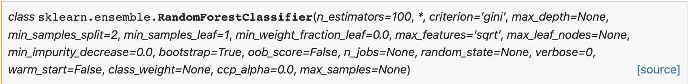

# Models

After recording, processing, and extracting features from a window of EMG data, it is passed to a machine learning algorithm for prediction. These control systems have evolved in the prosthetics community for continuously predicting muscular contractions for enabling prosthesis control. Therefore, they are primarily limited to recognizing static contractions (e.g., hand open/close and wrist flexion/extension) as they have no temporal awareness. Currently, this is the form of recognition supported by LibEMG and is an initial step to explore EMG as an interaction opportunity for general-purpose use. This section highlights the machine-learning strategies that are part of `LibEMG`'s pipeline.

There are two types of models supported in `LibEMG`: classifiers and regressors. Classifiers output a discrete motion class for each window, whereas regressors output a continuous prediction along a degree of freedom. For both classifiers and regressors, `LibEMG` supports statistical models as well as deep learning models. Additionally, a number of post-processing methods (i.e., techniques to improve performance after prediction) are supported for all models.

## Statistical Models

The statistical models (i.e., traditional machine learning methods) implemented leverage the sklearn package. For most cases, the "base" models use the default options, meaning that the pre-defined models are not necessarily optimal. However, the `parameters` attribute can be used when initializing the models to pass in additional sklearn parameters in a dictionary. For example, looking at the `RandomForestClassifier` docs on sklearn:



A classifier with any of those parameters using the `parameters` attribute. For example:

```Python
parameters = {
    'n_estimators': 99,
    'max_depth': 20,
    'random_state': 5,
    'max_leaf_nodes': 10
}
classifier.fit(data_set, parameters=parameters)
```

The same process can be done using the `RandomForestRegressor` from sklearn and an `EMGRegressor`. Please reference the [sklearn docs](https://scikit-learn.org/stable/) for parameter options for each model.

Additionally, custom models can be created. Any custom classifier should be modeled after the `sklearn` classifiers and must have the `fit`, `predict`, and `predict_proba` functions to work correctly. Any custom regressor should be modeled after the `sklearn` regressors and must have the `fit` and `predict` methods.

```Python
from sklearn.ensemble import RandomForestClassifier
from libemg.predictor import EMGClassifier

rf_custom_classifier = RandomForestClassifier(max_depth=5, random_state=0)
classifier = EMGClassifier(rf_custom_classifier)
classifier.fit(data_set)
```

## Deep Learning (Pytorch)

Another available option is to use [pytorch](https://pytorch.org/) models (i.e., a library for deep learning) to train the model, although this involves making some custom code for preparing the dataset and the deep learning model. For a guide on how to use deep learning models, consult the deep learning example. The same methods are expected to be implemented for both deep and statistical classifiers/regressors.
