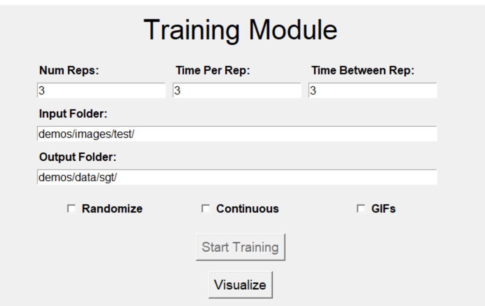
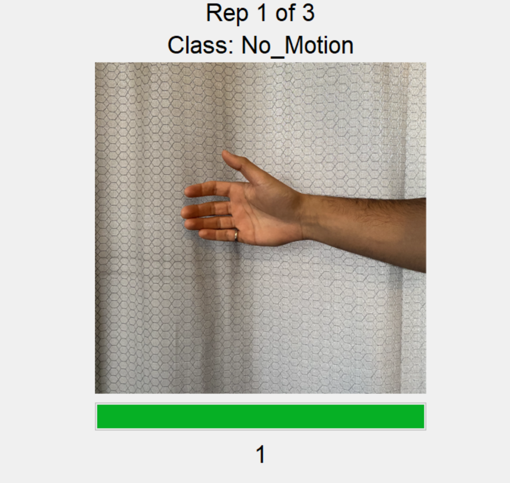
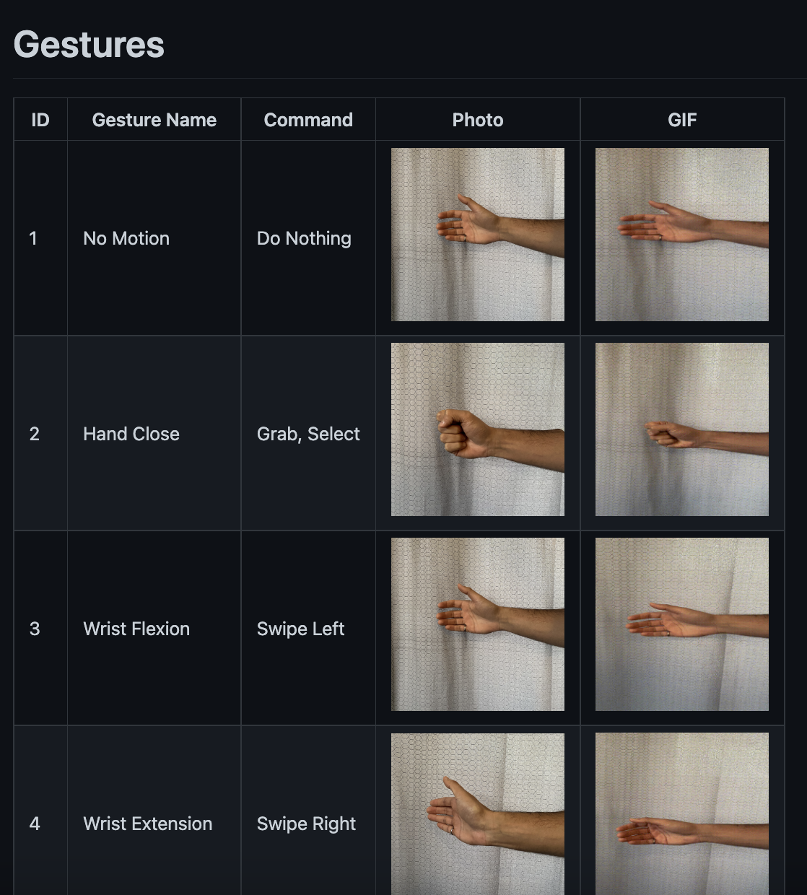
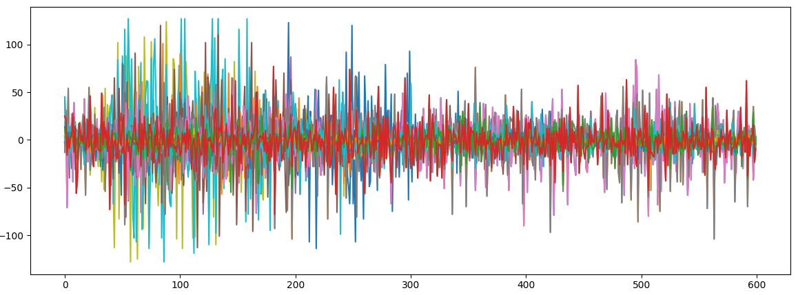
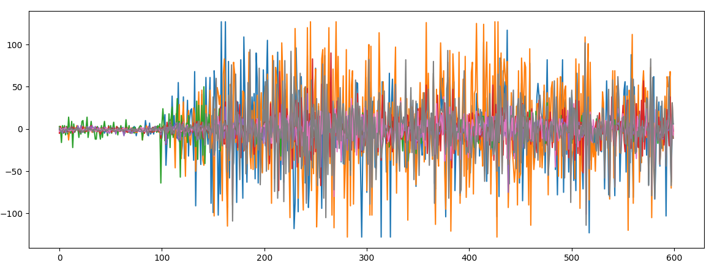

<style>
    table {
        width: 100%;
    }
</style>

Although not directly part of the EMG pipeline, the `Screen Guided Training` module provides developers a convenient means to collect real-time screen-guided training (SGT) data. This SGT data can be used to train a system (i.e., machine learning model) or for future offline analyses. Note that the SGT tool can handle image types of `png`, `jpg`, and `jpeg`. Additionally, it can handle `.gifs` for dynamic movements/contractions.

| <center>Menu</center>  | <center>SGT</center> |
| ------------- | ------------- |
|  |  |
<center> <p> Table 1: Screen Guided Training UI</p> </center>


# Gesture Library
One of the tedious aspects (and annoyances) of performing data collection is the need to accumulate photos (or videos) of each contraction. This process is not only time-consuming but also leads to inconsistencies among studies. To streamline this process, LibEMG includes a database of [~35 gestures](https://github.com/libemg/LibEMGGestures) (both static and dynamic) that can be interfaced and downloaded through the API.


<center> <p> Figure 1: A screenshot of the first four gestures of the <a href="https://github.com/libemg/LibEMGGestures"> gesture library </a>. Each gesture includes an index, a static image, and a dynamic gif. </p> </center>

Each gesture in the library is associated with a unique id that is referenced when specifying the gestures to download. A simple pipeline for setting up the SGT module is as follows: 

```Python
from libemg.gui import GUI
from libemg.data_handler import OnlineDataHandler
from libemg.streamers import myo_streamer

# Create data handler and streamer 
_, sm = myo_streamer()
odh = OnlineDataHandler(sm)

training_ui = GUI(self.odh, width=700, height=700, gesture_height=300, gesture_width=300)
training_ui.download_gestures([1,2,3,4,5], "images/")
training_ui.start_gui()
```

# Types of Training 
In general, the accumulation of training data can be split into one of two types: <b>static reps</b> and <b>ramp reps</b>. While ramp reps often lead to better performance, both training methods are viable. Static contractions involve eliciting the contraction for the entire rep duration. In this case, there is little variability other than that occurring throughout the contraction's duration. Ramp contractions start at rest and involve a transition to the contraction within the rep duration. This captures a range of variability for each contraction, which is crucial for velocity-based control systems. Table 2 highlights the differences between the two strategies. 

**Note, that when using velocity control, ramp contractions should be used.**

| <center>Type</center>  | <center>EMG</center> |
| ------------- | ------------- |
|  <center><b>Static</b></center> |  |
|  <center><b>Ramp</b></center> |  |
<center> <p> Table 2: Static training repetition (top) compared to a ramp training repetition (bottom). </p> </center>