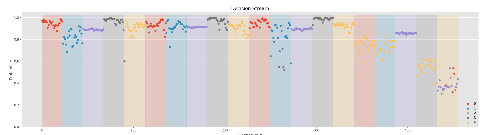

# Online Data Handler
There is different convenient functionality in the `OnlineDataHandler` to help developers. Firstly, two visualize functions: `visualize` and `visualize_channels`, exemplified in Table 1 are included.

```Python
from libemg.streamers import myo_streamer
from libemg.data_handler import OnlineDataHandler

if __name__ == "__main__":
    streamer, sm = myo_streamer()
    odh = OnlineDataHandler(sm)
    odh.visualize()
```

| <center>Combined</center>  | <center>All Channels</center> |
| ------------- | ------------- |
|   |    |
<center> <p> Figure 1: Raw Data from the <b>OnlineDataHandler</b></p> </center>

# EMG Classifier 
The EMG classifier contains a visualization tool for viewing the decisions stream (i.e., the predictions over time) for a particular classifier using the `visualize` function. 



<center> <p> Figure 2: The decision stream of a classifier.</b></p> </center>

# Feature Extractor 
The Feature Extrator and Online Data Handler contain a visualization tool for viewing the PCA feature space. This can be done using the `visualize_feature_space` function. If this function is run on an online data handler, a live PCA feature space will be shown (see Figure 3). 

| <center>Offline</center>  | <center>Online (Live)</center> |
| ------------- | ------------- |
|   |  |
<center> <p> Figure 3: The PCA feature space of a set of data.</p> </center>

# Filtering 
The filtering module has a `visualize_effect` function that demonstrates the effect of a filter on a set of data in the time and frequency domain. 


<center> <p> Figure 4: Data before and after filtering in the time and frequency domain.</p> </center>