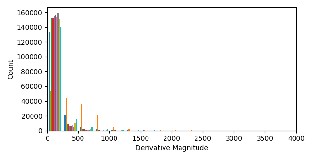
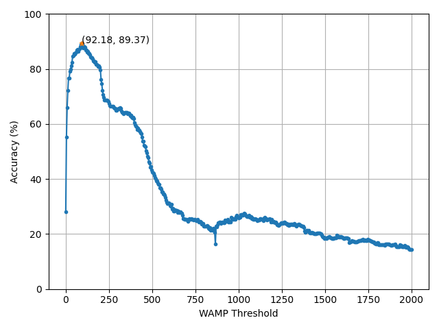

[View Source Code](https://github.com/libemg/LibEMG_FeatureOptimization_Showcase)

<style>
    .center {
        display: block;
        margin-left: auto;
        margin-right: auto;
        width: 50%;
    }
</style>

Although we provide default values for various tunable parameters within the feature extraction module, we highly recommend optimizing these parameters to give the best performance for your specific project. There are a number of influences that change project to project that can influence the optimal parameters involved in feature extraction. The hardware of your project could result in the default values being suboptimal, for instance, instrumentation amplifiers change the scale of the signal and the sampling rate determines what frequency bands are available to capture information from. For different gesture sets, you may want to increase or decrease sensitivity of features (for instance by tuning the Willison's amplitude threshold). There are also numerous other factors you'd like to be robust to and various features have their own sensitivity parameters that can minimize how much of this exogenous variability is captured. For all these reasons, we are providing a simple walkthrough that shows how you can optimize the parameters going into the feature extraction functions.

In this example, we will be determining the best Willison's amplitude threshold for a single subject of the 3DCDataset. Let's first prepare the dataset, using the same procedure as prior examples. First, load in the dataset and load it into an OfflineDataHandler. Next, separate the subject's data into an optimization set and a testing set. The analysis set will be split into a training and validation set using the first 3 reps for the training set and the final rep for the validation set. The remaining 4 reps will held-out of the optimization process and used for the testing set.

```Python
# Let's load in a single subject's worth of data to illustrate the process
# of finding the best feature parameter
dataset = libemg.datasets._3DCDataset(redownload=False)
odh = dataset.prepare_data(subjects_values = ["1"])
# For this process, lets split the dataset into training and testing sets using the 
# "sets" metadata tag.
training_odh = odh.isolate_data("sets", [0])
test_odh = odh.isolate_data("sets", [1])
# For the feature parameter optimization, let further split the training dataset into a 
# "train" and "validation" set using the first three reps for training and the final rep
# for validation. 
valid_odh  = training_odh.isolate_data("reps", [3])
train_odh  = training_odh.isolate_data("reps", [0,1,2])
# Given that these are stored data from as Thalmic labs myoarmband, lets use a window size of
# 50 samples and an increment of 10 samples.
valid_windows, valid_metadata = valid_odh.parse_windows(50, 10)
train_windows, train_metadata = train_odh.parse_windows(50, 10)
```

Although we could define a large search space around a reasonable region, we can get a good idea of potential values for thresholds by visual inspection. Willison's amplitude computed the number of times the magnitude of the derivative exceeds a certain value. We can quickly visualize the distribution of the absolute value of the derivative to and see what a reasonable test range would be.

```Python
# Taking a look a the range of the EMG signals of the _3DCDataset, these seem to be 
# integer values. Let's quickly get an idea of what may be the appropriate range to 
# test for the WAMP threshold by inspecting the train_odh.
derivatives = np.vstack([np.abs(np.diff(np.array(i),axis=0)) for i in train_odh.data[:]])
plt.hist(derivatives, 100)
plt.xlim(0, 4000)
plt.show()
```


From this visualization, it looks like a reasonable range for thresholds is 0-2000. We can define those test points using np.linspace.
```Python
# Lets initialize a grid search within that range.
test_points = 500
threshold_values = np.linspace(0, 2000, num=test_points)
```

Now we can finally begin iterating through assessing the accuracy of these test thresholds! We will prepare the feature extractor object and offline metrics object from libemg. Then in a loop, we will extract train and validation features using our test value for the WAMP threshold.

```Python
# Begin computing the feature accuracies
fe = libemg.feature_extractor.FeatureExtractor()
om = libemg.offline_metrics.OfflineMetrics()
for tp in range(test_points):
    # using a dictionary with "WAMP_threshold" keyword to specify the test point
    dic = {
        "WAMP_threshold": float(threshold_values[tp])
    }
    train_features = fe.extract_features(["WAMP"], train_windows, dic)
    valid_features = fe.extract_features(["WAMP"], valid_windows, dic)
    model = libemg.emg_predictor.EMGClassifier("LDA")
    feature_dictionary = {"training_features": train_features,
                            "training_labels":   train_metadata["classes"]}
    try:
        # If we use a try block, we don't need to worry about non-invertable matrices
        # The results would just stay 0 as initialized.
        model.fit(feature_dictionary = feature_dictionary)
        predictions, probabilties = model.run(valid_features)
        threshold_results[tp] = om.get_CA(valid_metadata["classes"], predictions) * 100
    finally:
        continue
```

And we can visualize the results for each of our test points to determine the best threshold value.

```Python
# plot the accuracies vs the thresholds
plt.plot(threshold_values, threshold_results, marker='o', ms=3)
best_threshold = np.argmax(threshold_results)
plt.plot(threshold_values[best_threshold], threshold_results[best_threshold], marker="*", ms=5)
plt.xlabel("WAMP Threshold")
plt.ylabel("Accuracy (%)")
plt.ylim((0, 100))
plt.grid()
plt.text(threshold_values[best_threshold],threshold_results[best_threshold], "({:.2f}, {:.2f})".format(threshold_values[best_threshold],threshold_results[best_threshold] ))
plt.show()
```


From this figure, we have found that the best threshold value is 92. We can now use this value on our held-out test set.

```Python
# Now let's apply this on our test set:
dic = {
        "WAMP_threshold": float(threshold_values[best_threshold])
    }
# Quick reminder: train_odh refers to the combined "train" and validation set
train_windows, train_metadata = training_odh.parse_windows(200,50)
test_windows, test_metadata   = test_odh.parse_windows(200,50)
train_features = fe.extract_features(["WAMP"], train_windows, dic)
test_features  = fe.extract_features(["WAMP"], test_windows, dic)
feature_dictionary = {"training_features": train_features,
                        "training_labels":   train_metadata["classes"]}
model = libemg.emg_predictor.EMGClassifier("LDA")
model.fit(, feature_dictionary = feature_dictionary)
predictions, probabilties = model.run(test_features)
test_accuracy = om.get_CA(test_metadata["classes"], predictions) * 100 

print("Test accuracy with optimal WAMP threshold: {:.2f}%".format(test_accuracy))
```
Test accuracy with optimal WAMP threshold: 84.30%.

We now have completed the whole process of determining the best parameter for a tunable feature extraction method and shown how to install it for a held-out test set. This process is not very computationally expensive (as it can be done in minutes on pilot data), but does yield a meaningful improvement in the expected performance of the model. In this example, we used the classification accuracy offline metric to determine what threshold was best, but this could be substituted for any metric the pipeline designer wishes to optimize. The metric being optimized can enforce different behaviours. For instance, we maximized classification accuracy should result in a model that performs best across all classes. However, if minimal active error was used as the optimization goal, incorrect predictions of active motion classes would have been silenced whenever possible. The notion that the metric being optimized influences the feel of the system is also an important consideration when running feature selection.
