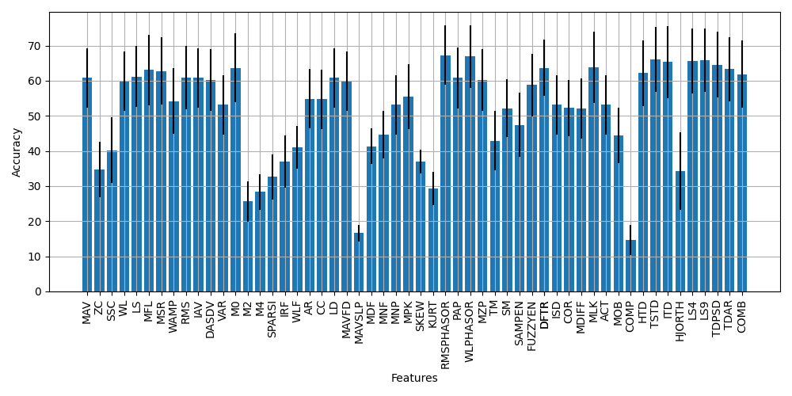

[View Source Code](https://github.com/libemg/LibEMG_Feature_Showcase)

<style>
    .center {
        display: block;
        margin-left: auto;
        margin-right: auto;
        width: 50%;
    }
</style>

Although there are many approaches for designing EMG pattern recognition pipelines (using established feature sets, using automatic feature selection approaches, or using deep learning directly on the signals), a good first step would be to determine the offline accuracy on a dataset that matches your hardware and gesture set for the available features and feature sets provided by the library. That's exactly what we're going to do in this first example! This is a good template for how to use the library and will cover many common tasks such as:

1. Loading in a public dataset
2. Slicing the dataset by subject and repetition
3. Windowing the data
4. Extracting features from the windows
5. Training a classifier
6. Determining the performance of that classifier on test data

The first part of this analysis is to prepare the dataset. For this example, the 3DC dataset was chosen (see included datasets).

When the dataset has been downloaded (data for each subject is zipped), it can be prepared into a LibEMG friendly format and using provided utilities. This will convert the .zip files to folders containing many .csv files that contain a single motion. 
```Python
dataset = libemg.datasets._3DCDataset(save_dir = ".")
```

At this point, we can also instantiate various objects that correspond to the modules of the library. We will need a feature extractor, and offline metric object. We can also query the features and feature groups the library provides at the same time.
```Python
fe = libemg.feature_extractor.FeatureExtractor()
feature_list = fe.get_feature_list()
feature_group_list = fe.get_feature_groups()
om = libemg.offline_metrics.OfflineMetrics()
```

Now, we can iterate within-subject and test the accuracy of each available feature / feature set. First we isolate the training and test sets using the prescribed validation scheme of the 3DC authors. Next we can window the motions to prepare for feature extraction.
```Python
for s in subject_list:
    odh = dataset.prepare_data(subjects_values=[str(s+1)], classes_values=classes_values)
    train_odh = odh.isolate_data("sets",[0])
    test_odh = odh.isolate_data("sets",[1])
    train_windows, train_metadata = train_odh.parse_windows(window_size, window_increment)
    test_windows,  test_metadata  = test_odh.parse_windows(window_size, window_increment)
```

Now, we can nest another loop that extracts individual feature and feature sets from these prepared windows. Once the features are extracted we can prepare the feature dictionary (a standard format for the libemg.emg_predictor.EMGClassifier object that indicates you want to use handcrafted features).
```Python
for f in range(len(feature_list)+len(feature_group_list)):
    if f < len(feature_list):
        feature = feature_list[f]
        train_features = fe.extract_features([feature], train_windows,feature_parameters)
        test_features = fe.extract_features([feature], test_windows,feature_parameters)
    else:
        feature = list(feature_group_list.keys())[f-len(feature_list)]
        train_features = fe.extract_feature_group(feature, train_windows,feature_parameters)
        test_features = fe.extract_feature_group(feature, test_windows,feature_parameters)
    feature_dictionary = {
        "training_features": train_features,
        "training_labels": train_metadata["classes"]
    }
```

Finally, with these features prepared we can train a classifier and determine the classification accuracy:
```Python
clf = libemg.emg_predictor.EMGClassifier('LDA')
clf.fit(feature_dictionary.copy())
preds = clf.run(test_features)
results[s,f] = om.extract_offline_metrics(["CA"], test_metadata["classes"], preds[0])["CA"] * 100
print("Subject: {}, Feature: {}, Accuracy: {}".format(s+1, feature, results[s,f]))
```
From this analysis, we are able to see how the performance of the available features and feature sets on 3DC Dataset This is a valuable first step that could be iterated upon by exploring filtering methods, determining custom feature sets through selection, changing the underlying classifier of the EMGClassifier object (perhaps even to deep learning), or optimizing the extraction of features themselves through determining the best parameters for each feature extraction method.




In this procedure, we have used LibEMG to import a public dataset, slice it according to a prescribed training/testing split, performed windowing, extracted features, trained a classifier, and determined accuracy on the test set. This was all done with relatively few lines of code, but still allows the designer to customize the pipeline as they see fit.